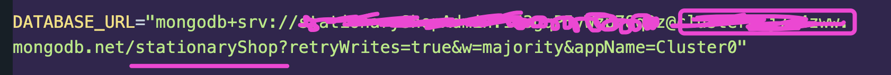

# Stationary Shop

## 🟪 Technologies used:

-  NodeJs/ ExpressJs as server
-  Mongoose as ODM
-  MongoDB as database
-  TypeScript
-  Zod

## 🟪 Features

🟣 This backend application covers the basic CRUD operations for Products and Orders of a Stationary shop

🟣 Filtering of products based on name, brand or category.

🟣 Stock and product validation before placing an order

🟣 Total Revenue the shop has generated through its orders

### 📋 Product CRUD APIs:

1. 🧭 Create products and insert into the database.

   Method: POST

   API: `/api/products`

2. 🧭 Get all products or certain based on name, category or brand.

   Method: GET

   API: `/api/products`

3. 🧭 Get a single product data using product id.

   Method: GET

   API: `/api/products/:id`

4. 🧭 Update a single product information.

   Method: PUT

   API: `/api/products/:id`

5. 🧭 Delete a product from the database.

   Method: DELETE

   API: `/api/products/:id`

### Order CRUD APIs:

1. 🧭 Create an order into the database, based on the product id as reference.

-  order will be only placed if the product and the stock is available.
-  stock quantity and status(if needed) will be updated after placing an order.

   Method: POST

   API: `/api/orders`

2. 🧭 Get all order information.

   Method: GET

   API: `/api/orders`

3. 🧭 Get total revenue from all orders combined.

   Method: GET

   API: `/api/orders/revenue`

4. 🧭 Get a single order data using order id.

   Method: GET

   API: `/api/orders/:id`

5. 🧭 Update a single order information.

   Method: PUT

   API: `/api/orders/:id`

6. 🧭 Delete an order from the database.

   Method: DELETE

   API: `/api/orders/:id`

## 🟪 How to setup the project locally

First make sure you have `node` installed in your machine.

Check it using this command on the terminal:

```
node -v
```

If, node is not installed, install it following the guideline and install the LTS(Long term support) version of it.

https://nodejs.org/en

If node version is found then:

### 👉 Step 1: Download or Clone the GitHub repository

Clone command:

```
git clone <repository-url>
```

### 👉 Step 2: Open the project folder in the terminal

Go to the folder and open it in the terminal.

You can also open the folder using the terminal by following command:

```
cd <project-folder-name>
```

### 👉 Step 3: Install dependencies

Run the following command:

```
npm install
```

It will download all the necessary node packages needed for the project.

### 👉 Step 4: Open the folder using VSCode or any of your preferred code editor.

Manually open the folder in your editor or you can use this command to open:

```
code .
```

### 👉 Step 5: Create a `.env` file in the root folder

Create a `.env` and add your mongoDB url and port number.

```
PORT=give your port number here

DATABASE_URL=give your mongo db uri here.
```

For database url make sure to mention your database name(the one you want to create) shown below:



### 👉 Step 6: Run the following commands according to your requirements:

#### 1. To start server locally:

```
npm run start:dev
```

#### 2. to convert all the TypeScript files into JavaScript files (which will be stored in the dist folder):

```
npm run build
```
